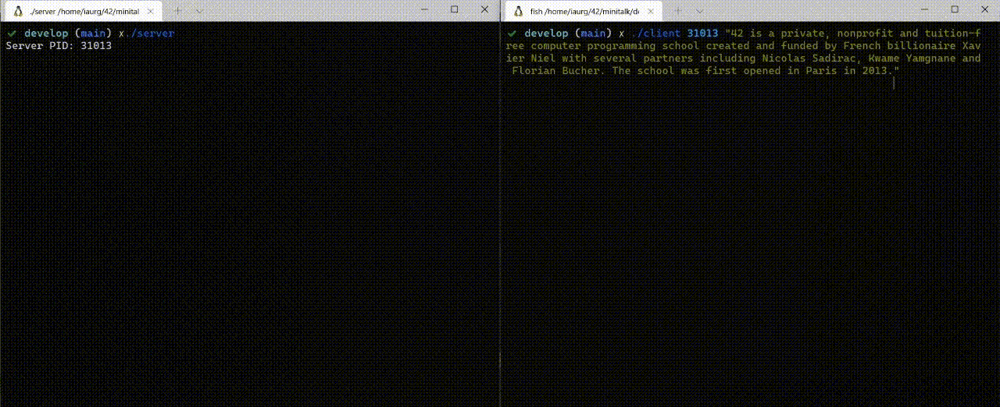

# 42-minitalk



Think in binary...

The purpose of this project is to code a small data exchange program using
UNIX signals.

Made with PDF version 2.

### Resources:

[Sending and Handling Signals in C (kill, signal, sigaction)](https://www.youtube.com/watch?v=83M5-NPDeWs)

[Short introduction to signals in C](https://www.youtube.com/watch?v=5We_HtLlAbs)

Signals communicate between proccesses

usleep stops for some time the execution

[getpid()](https://man7.org/linux/man-pages/man2/getpid.2.html) - Gets process ID

Signals work as something that send notifications to processes

Process decides what to do when the signal arrives, using a handler

[Signal numbering for standard signals](https://man7.org/linux/man-pages/man7/signal.7.html)

SIGUSR1 = 10

SIGUSR2 = 12

signals can be sent three ways: -9, -SIGUSR1, USR1

[kill()](https://www.ibm.com/docs/en/i/7.2?topic=ssw_ibm_i_72/apis/sigkill.htm) Send Signal to Process or Group of Processes

Avoid using signal() from manual:

The behavior  of signal() varies across UNIX versions, and has also varied historically across different versions of Linux.  Avoid its use: use sigaction(2) instead.  See Portability below.

[sigaction manual](https://man7.org/linux/man-pages/man2/sigaction.2.html)

[Mastering Signals in Linux System](https://www.youtube.com/watch?v=L3XuR-iRysU&list=PLysdvSvCcUhbrU3HhGhfQVbhjnN9GXCq4&index=42)

[How to knows PID from sender](https://stackoverflow.com/questions/11508427/linux-c-upon-receiving-a-signal-is-it-possible-to-know-the-pid-of-the-sender)

[Binary converter](https://c-for-dummies.com/blog/?p=3032)

[Bitwise converter](https://www.tutorialspoint.com/cprogramming/c_bitwise_operators.htm)

[Generate random number of characters](http://www.unit-conversion.info/texttools/random-string-generator/)

A way to think in bitwise: you count from end to start, and need to invert it using bitwise to get a right binary value in decimal.

```
a = 110000 = 48
holder += 1 << 6;
holder += 1 << 5;
holder += 0 << 4;
holder += 0 << 3;
holder += 0 << 2;
holder += 0 << 1;
holder += 0 << 0;
```

### Interesting:

https://www.youtube.com/watch?v=X8jsijhllIA
